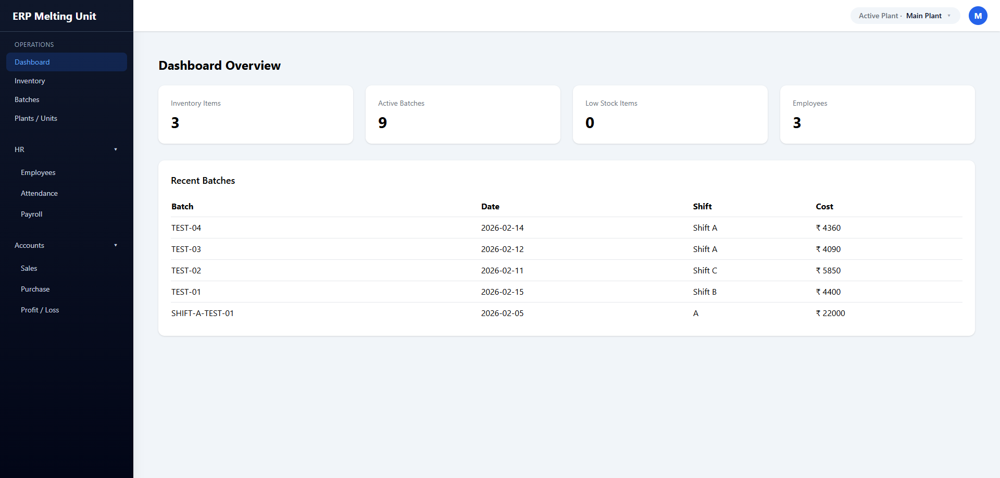
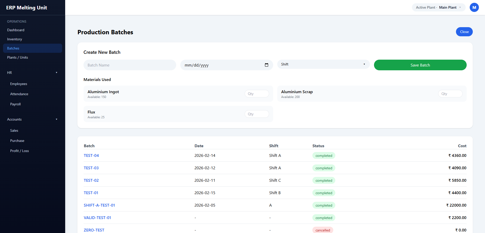
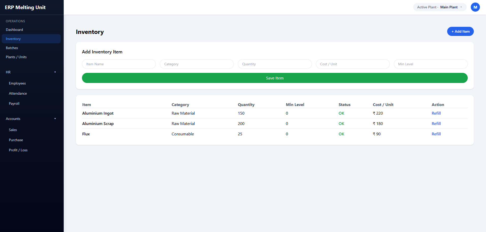
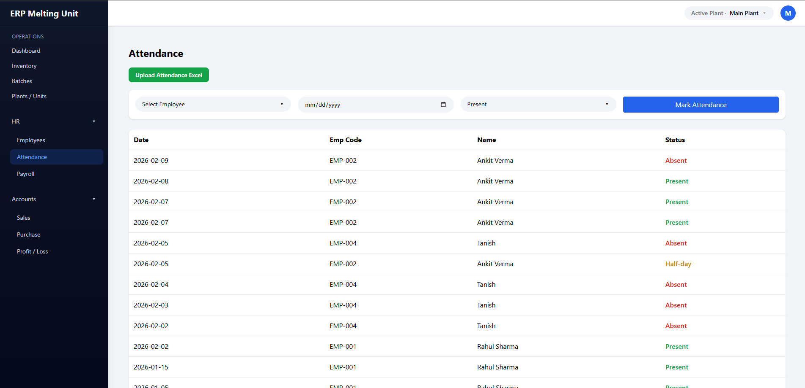
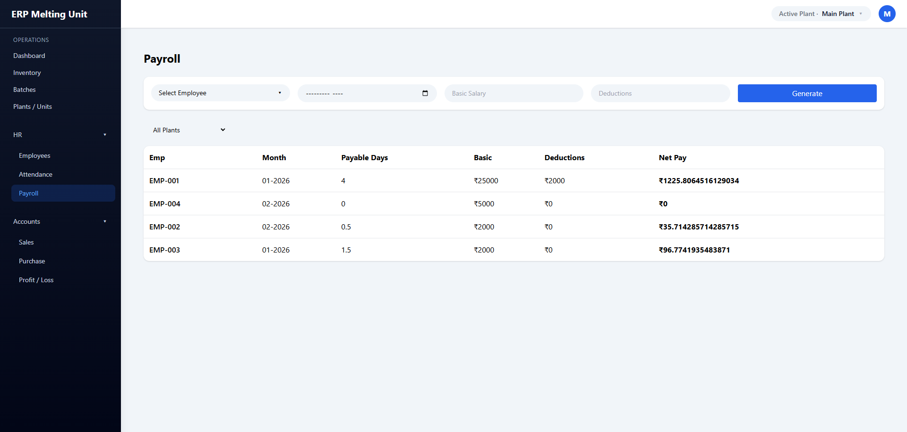

# 🏭 ERP Melting Unit System

A full-stack ERP system designed to simulate real-world operational workflows for a manufacturing melting unit. This project focuses on data integrity, business rule enforcement, and plant-scoped architecture rather than surface-level CRUD functionality.

Built to reflect how enterprise systems handle interconnected modules across operations, HR, and finance.

---

## 🚀 Tech Stack

**Frontend**
- React (Vite)
- Tailwind CSS

**Backend**
- Flask (REST APIs)
- SQLite

**Architecture**
- Modular REST-based design
- Plant-scoped data filtering
- Context-aware state management
- Business rule enforcement at API + database level

---

## 🧠 Core Design Philosophy

This system was built around one idea:

> ERP systems are about flow and integrity — not forms.

Key principles implemented:
- Controlled state transitions (no invalid data states)
- Transaction-aware inventory deduction
- Prevention of negative stock or over-consumption
- Plant-based data isolation
- Attendance-driven payroll computation
- Downstream dependency validation (attendance → payroll, inventory → batches)
- Clean entity lifecycle management

The database acts as a contract, not just storage.

---

## 📦 Modules Implemented

### 🏭 Operations
- **Dashboard** – Aggregated metrics and batch overview
- **Inventory**
  - Add items
  - Refill existing stock
  - Cost per unit tracking
  - Minimum level alerts
- **Production Batches**
  - Multi-material consumption
  - Automatic material cost calculation
  - Inventory deduction logic
  - Completion state tracking
- **Plant Management**
  - Active plant context switching
  - Plant-scoped operations

### 👥 HR
- **Employees**
  - Plant assignment
  - Status-based activation/deactivation
- **Attendance**
  - Manual entry
  - Structured tracking
- **Payroll**
  - Attendance-based payable days
  - Deductions handling
  - Net pay computation

### 💼 Accounts
- Sales
- Purchase
- Basic Profit/Loss tracking

---

## 🔄 ERP Flow Overview

This system enforces realistic operational dependencies:
```
Inventory → Production Batch → Cost Calculation
Employees → Attendance → Payroll
Plant Context → All Module Data Filtering
```

Each action propagates through related modules in a controlled manner.

---

## 📸 Screenshots

### Dashboard Overview


### Production Batch Creation


### Inventory Management


### Attendance Tracking


### Payroll Generation


---

## ⚙️ Running the Project

**Backend**
```bash
cd backend
pip install -r requirements.txt
python app.py
```

**Frontend**
```bash
cd frontend
npm install
npm run dev
```

---

## 📌 Why This Project Matters

This ERP system is not a UI experiment. It is a structured attempt to understand:
- Enterprise system design
- API-driven architecture
- Data consistency across modules
- Business logic enforcement
- Real-world operational constraints

It reflects how different domains interact inside a single unified system.

---

## 📬 Connect

Open to discussions around:
- ERP architecture
- Backend system design
- REST API structuring
- State management in enterprise apps
